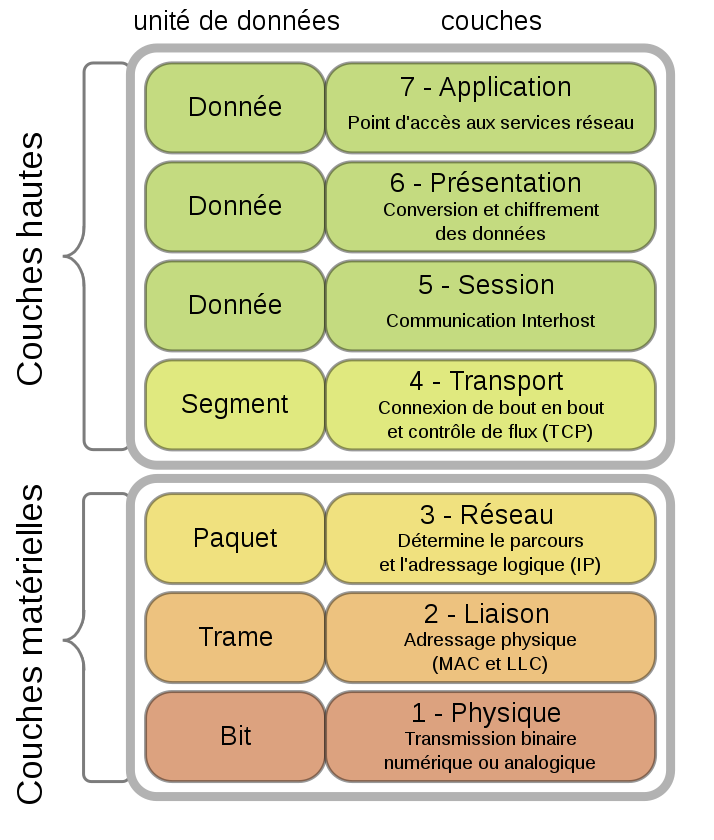
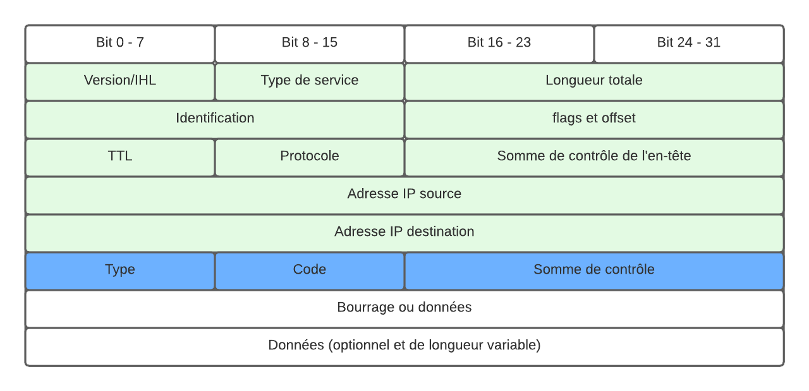

# ICMP

## Qu'est-ce que le protocole ICMP ? [[1]](https://www.ionos.fr/digitalguide/serveur/know-how/quest-ce-que-le-protocole-icmp/) [[2]](https://fr.wikipedia.org/wiki/Internet_Control_Message_Protocol#cite_note-5) [[3]](https://www.editions-eni.fr/open/mediabook.aspx?idR=769233a055093dd8a2a414361a469394)
---

ICMP ou Internet Control Message Protocol est un protocole faisant parti de l'ensemble des protocoles TCP/IP et sert à la transmission de messages de contrôle et d'erreur. 

A ce jour, il existe 2 versions : une pour l'Ipv4, décrite dans l'RFC 792 [[4]](https://datatracker.ietf.org/doc/html/rfc792) en 1981, et une pour l'Ipv6 [[5]](https://fr.wikipedia.org/wiki/Internet_Control_Message_Protocol_V6), décrite dans l'RFC 4443 [[6]](https://datatracker.ietf.org/doc/html/rfc4443) en 2006.

## Pourquoi utiliser ICMP ? [[2]](https://fr.wikipedia.org/wiki/Internet_Control_Message_Protocol#cite_note-5) [[4]](https://datatracker.ietf.org/doc/html/rfc792)
---

Le but d'ICMP est de signaler et contrôler les problèmes lors d'une transmission. Par exemple, c'est grâce à lui qu'on sait que la destination n'est pas atteignable ou qu'il y a eu une redirection. De ce fait, il doit être implémenté dans chaque module IP.
Il faut également savoir qu'aucun message ICMP n'est envoyé pour répondre à la réception d'une autre message ICMP et ce, afin d'éviter des problèmes de bouclage sans fin.

Pour finir, faite attention, son but n'est pas de rendre le protocole IP (Internet Protocol) fiable. Il ne garantit en rien l'arrivée d'un paquet de données à sa destination et ne signale pas la perte d'un paquet lors de sa transmission. 


## ICMP et le modèle OSI [[2]](https://fr.wikipedia.org/wiki/Internet_Control_Message_Protocol#cite_note-5) [[3]](https://www.editions-eni.fr/open/mediabook.aspx?idR=769233a055093dd8a2a414361a469394)
---

Le protocole ICMP est un protocole de couche 3 sur le modèle OSI mais est traité comme un se situant sur une couche supérieure lors de son encapsulation dans le protocole IP.
<p align="center">
    
</p>

## Fonctionnement d'ICMP
---

ICMP utilise un système de types et de codes qui permet d'identifier le type de message et l'état de ce dit type.

### Les types et leurs codes [[7]](https://www.iana.org/assignments/icmpv6-parameters/icmpv6-parameters.xhtml#icmpv6-parameters-2) [[8]](https://www.iana.org/assignments/icmp-parameters/icmp-parameters.xhtml)
---
Les types sont différenciés à l'aide d'un numéro allant de 0 à 255 qui leur est propre et sont accompagnés par un ou plusieurs codes permettant d'identifier le problème/contrôle.

Exemples en IPv4 :
Type | Code | Description
---- | ---- | -----------
0 - Réponse d'écho | 0 | Réponse d'echo 
3 - Destinataire inaccessible | 0 | Réseau inaccessible
3 - Destinataire inaccessible | 1 | Machine inaccessible
3 - Destinataire inaccessible | 2 | Protocole inaccessible
3 - Destinataire inaccessible | 3 | Port inaccessible
8 - Demande d'écho | 0 | Demande d'écho

Il faut également savoir que les numéros de types sont différents suivants la version d'ICMP qu'on utilise. Ainsi, le type 1 en IPv6 n'est pas forcément le même qu'en IPv4.

Si vous voulez plus de détails sur ces numéros et codes, voici la documentation de L'IANA à ce sujet : <a href="http://www.iana.org/assignments/icmpv6-parameters/icmpv6-parameters.xhtml#icmpv6-parameters-2"> IPv6 </a> et <a href="https://www.iana.org/assignments/icmp-parameters/icmp-parameters.xhtml"> IPv4 </a>


### Format d'un paquet ICMP [[1]](https://www.ionos.fr/digitalguide/serveur/know-how/quest-ce-que-le-protocole-icmp/) [[2]](https://fr.wikipedia.org/wiki/Internet_Control_Message_Protocol#cite_note-5) [[3]](https://www.editions-eni.fr/open/mediabook.aspx?idR=769233a055093dd8a2a414361a469394) [[5]](https://fr.wikipedia.org/wiki/Internet_Control_Message_Protocol_V6)
---

Même si le protocole ICMP se trouve sur la même couche que le protocole IP, il ne dispose pas d'un paquet propre. En effet, il est directement encapsulé dans un paquet IP. De ce fait, ICMP est traité par IP comme étant un protocole de couche supérieure. 

Le format en IPv4 contient :

<p align="center">
    
</p>

- un en-tête IPv4 (en vert). La valeur de _Protocole_ est 1 et celle de _Type de Service_ est 0.
- un en-tête ICMP (en bleu) :
    - Type : le numéro du type de message
    - Code : le code décrivant l'état du type
    - Somme de contrôle : permet de vérifier que les données n'ont pas été corrompu en chemin.

Le format en IPv6 est semblable à celui en IPv4 mais son en-tête IP est adapté à la version 6.

## Ping et ICMP [[9]](https://linux.die.net/man/8/ping)
---

Ping est une commande très connue qui utilise des paquets ICMP (plus précisément des _ECHO_REQUEST ICMP_ et des _ECHO_RESPONSE ICMP_) afin d'obtenir plusieurs informations sur le réseau. 

Pour effectuer une requête ping, il faut saisir, au minimum, ceci : `ping  adresseIP/nomHôte`

Par exemple : 

Taper `ping canopus` donnera ceci :
```
PING canopus.austin.century.com: (128.116.1.5): 56 data bytes
64 bytes from 128.116.1.5: icmp_seq=0 ttl=255 time=2 ms
64 bytes from 128.116.1.5: icmp_seq=1 ttl=255 time=2 ms
64 bytes from 128.116.1.5: icmp_seq=2 ttl=255 time=3 ms
64 bytes from 128.116.1.5: icmp_seq=3 ttl=255 time=2 ms

----canopus.austin.century.com PING Statistics----
4 packets transmitted, 4 packets received, 0% packet loss
round-trip min/avg/max = 2/2/3 ms
```
Une réponse standard contient différentes informations : le nombre de bytes envoyé par paquet, la destination, le numéro du paquet, le TTL nécessaire pour atteindre la destination, le temps que cela a nécessité et le nombre de paquets perdus et réceptionnés . D'autres informations peuvent être obtenues en fonction des paramètres que l'on choisit. Plus de détails [ici](https://linux.die.net/man/8/ping). 

## Alternative à ICMP et à PING [[10]](https://linux.die.net/man/1/echoping) [[11]](https://linux.die.net/man/8/arping) [[12]](https://curl.se/)
---

Le problème avec la commande ping et ICMP en général, est qu'une grande partie du trafic ICMP est bloquée par les pare-feu des réseaux pour diverses raisons de sécurité. Dans ce cas, voici plusieurs alternatives :
- echoping [[10]](https://linux.die.net/man/1/echoping) : fonctionne de manière similaire à ping. Sa grande différence est qu'il utilise TCP au lieu d'ICMP. 
- arping [[11]](https://linux.die.net/man/8/arping) :  fonctionne de manière similaire à ping. Il utilise des paquets ARP pour vérifier l'état de la destination. On peut également utiliser des adresses MAC avec cette commande.
- curl  [[12]](https://curl.se/) : alternative majoritairement utilisée pour tester la connectivité d'un site.

## Bibliographie 

1. [Qu'est-ce que le protocole ICMP ?](https://www.ionos.fr/digitalguide/serveur/know-how/quest-ce-que-le-protocole-icmp/), Digital Guide IONOS, le 05/03/2019, consulté le 31/05/2022
    - _Résumé : Explication générale d'ICMP_
    - _Avis sur la ressource : Permet de se faire une idée en gros du sujet_

2. [Internet Control Message Protocol](https://fr.wikipedia.org/wiki/Internet_Control_Message_Protocol#cite_note-5), Wikipedia, 27/12/2021, consulté le 31/05/2022
    - _Résumé : Explication générale d'ICMPv4_
    - _Avis sur la ressource : Fiable et permet d'étoffer quelques détails_

3. [ICMP](https://www.editions-eni.fr/open/mediabook.aspx?idR=769233a055093dd8a2a414361a469394), Cisco, consulté le 31/05/2022
    - _Résumé : Extrait du livre de Cisco sur les notions de base en sur les réseaux_
    - _Avis sur la ressource : Fiable et résume en quelque ligne et de manière suffisante (pour cet article) ICMP_

4. [RFC 792](https://datatracker.ietf.org/doc/html/rfc792), J.Postel, septembre 1981, consulté le 31/05/2022
    - _Résumé : RFC détaillant l'implémentation d'ICMPv4_
    - _Avis sur la ressource : Fiable et explique de manière détailler ICMPv4_

5. [Internet Control Message Protocol V6](https://fr.wikipedia.org/wiki/Internet_Control_Message_Protocol_V6), Wikipedia, 10/10/2017, consulté le 31/05/2022
    - _Résumé : Explication générale d'ICMPv6_
    - _Avis sur la ressource : Fiable et permet d'étoffer quelques détails_

6. [RFC 4443](https://datatracker.ietf.org/doc/html/rfc4443), A.Conta & S.Deering & M.Gupta, mars 2003, consulté le 31/05/2022
    - _Résumé : RFC détaillant l'implémentation d'ICMPv6_
    - _Avis sur la ressource : Fiable et reprenant l'implémentation d'ICMPv4 mise à jour pour ICMPv6_

7. [Internet Control Message Protocol version 6 (ICMPv6) Parameters](https://www.iana.org/assignments/icmpv6-parameters/icmpv6-parameters.xhtml#icmpv6-parameters-2), Iana, 27/04/2022, consulté le 31/05/2022
    - _Résumé : Document de l'Iana regroupant tous les codes et types d'ICMPv6_
    - _Avis sur la ressource : Fiable et permet d'avoir la liste complète et expliquée de tous les paramètres d'ICMPv6_

8. [Internet Control Message Protocol (ICMP) Parameters](https://www.iana.org/assignments/icmp-parameters/icmp-parameters.xhtml), Iana, 25/09/2020, consulté le 31/05/2022
    - _Résumé : Document de l'Iana regroupant tous les codes et types d'ICMPv4_
    - _Avis sur la ressource : Fiable et permet d'avoir la liste complète et expliquée de tous les paramètres d'ICMPv4_
9. [ping(8) - Linux man page](https://linux.die.net/man/8/ping), Linux.die.net, consulté le 08/06/22
    - _Résumé : Page MAN de la commande ping_
    - _Avis sur la ressource : Fiable car il s'agit de la documentation provenant des pages MAN_

10. [echoping(1) - Linux man page](https://linux.die.net/man/1/echoping),Linux.die.net, consulté le 08/06/22
    - _Résumé : Page MAN de la commande echoping_
    - _Avis sur la ressource : Fiable car il s'agit de la documentation provenant des pages MAN_

11. [arping(8) - Linux man page](https://linux.die.net/man/8/arping),Linux.die.net, consulté le 08/06/22
    - _Résumé : Page MAN de la commande arping_
    - _Avis sur la ressource : Fiable car il s'agit de la documentation provenant des pages MAN_

12. [CURL://](https://curl.se/), curl, consulté le 08/06/22
    - _Résumé : Site web de CURL et sa documentation_
    - _Avis sur la ressource : Fiable car il s'agit du site officiel de curl_

