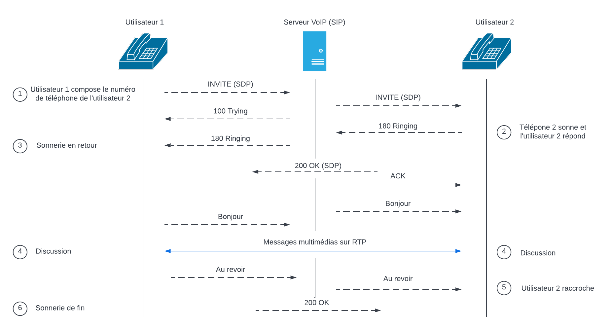
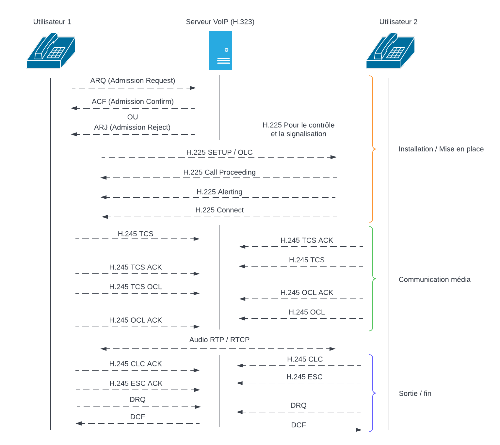

## 1. Introduction

### 1.1 Qu’est-ce que le protocole SIP?  [^1] [^2] 

   &nbsp;&nbsp;&nbsp;&nbsp;&nbsp;&nbsp;La « Session Initiation Protocol » (SIP) est un protocole TCP/IP de le couche applicative normalisée et standardisé par l’IETF*. Il s’agit d’un protocole de communication standard couramment utilisé dans les télécommunications multimédias. Ce dernier est le plus répandu dans la téléphonie par internet (la VoIP*).

   &nbsp;&nbsp;&nbsp;&nbsp;&nbsp;&nbsp;Le protocole SIP permet d’établir une « session » entre deux ou plus de participants, de modifier cette session et finalement de mettre fin à cette session.

   &nbsp;&nbsp;&nbsp;&nbsp;&nbsp;&nbsp;Par défaut, ce protocole est supporté sur le port 5060 par TCP ou UDP et pour sa version sécurisé, SIP-TLS, sur le port 5061 par défaut. Il fonctionne aussi bien avec l’IPv4 qu’avec l’IPv6.

   &nbsp;&nbsp;&nbsp;&nbsp;&nbsp;&nbsp;SIP est un protocole de type « requête-réponse ». Celui-ci est similaire aux protocoles internet tel que http et SMTP.

   &nbsp;&nbsp;&nbsp;&nbsp;&nbsp;&nbsp;SIP prend en charge cinq aspects afin de réaliser un établissement et une terminaison de communications multimédia :

* Localisation de l’utilisateur
* Disponibilité de l’utilisateur
* Capacités de l’utilisateur
* Établissement d’une session
* Gestion d’une session

### 1.2 Qu’est-ce que le protocole H.323? [^4] [^5] [^7]

   &nbsp;&nbsp;&nbsp;&nbsp;&nbsp;&nbsp;Comme le SIP, le H.323 est un protocole conçu pour initier, gérer et terminer des sessions médias. Cependant celui-ci est standarisé par L'IEEE*.

   &nbsp;&nbsp;&nbsp;&nbsp;&nbsp;&nbsp;Existant depuis 1996, Il est considéré comme assez ancien. C’est un protocole binaire et se fait remplacer par le SIP.

   &nbsp;&nbsp;&nbsp;&nbsp;&nbsp;&nbsp;Il utilise le numéro de port TCP 1720.

   &nbsp;&nbsp;&nbsp;&nbsp;&nbsp;&nbsp;Il ressemble davantage à une combinaison de plusieurs protocoles différents qui peuvent être regroupés en trois catégories :

* La signalisation
* La négociation de codec
* Le transport de l’information

### 1.3 Schéma illustrant une communication VoIP (session + multimédia)

#### SIP [^1]

    

#### H.323 [^8]

    

Documentation du schéma car ce dernier est plus complexe qu'une communication SIP :

* ARQ = Adminssion Request, demande l'autorisation de participer à un appel
* ACF = Admission Confirm, réponse positive pour cette appel
* ARJ = Admission Reject, réponse rejeter
* H.225 = Pour le contrôle, la signalisation et la gestion d'un appel
* H.245 = Défini pour les canaux des média par H.323
* TCS = Terminal capability set, codecs envoyé au terminal
* ACK = Accusé de réception
* OCL = Open logical channel, ouverture d'un chemin de communication
* CLC = Close logical channel, fermeture d'un chemin de communication
* ESC = End session command, commande pour mettre fin à la session
* DRQ = Disengage Request, mettre fin à l'appel
* DCF = Disengage Confirm, réponse pour mettre fin à l'appel

## 2. Comparaison entre ces deux protocoles [^1] [^2] [^3] [^4] [^5]

### 2.1 Codage des messages :

   &nbsp;&nbsp;&nbsp;&nbsp;&nbsp;&nbsp;Les messages H323 sont encodés dans un format binaire compact. Les messages sont efficacement codés et décodés par des machines (codec). Alors que ceux du protocole SIP, sont plus faciles à lire par l’homme, ils sont encodés au format ASCII. L’avantage du SIP est qu’il ressemble aux protocoles http/SMTP et est beaucoup plus simple que le H323. Cela rend le H323 moins convivial pour les techniciens dans un environnement de dépannage.

   &nbsp;&nbsp;&nbsp;&nbsp;&nbsp;&nbsp;Ils utilisent tous les deux le protocole RTP* comme protocole de transfert des données multimédia.

   &nbsp;&nbsp;&nbsp;&nbsp;&nbsp;&nbsp;Le SIP est plus léger car il est basé sur une approche similaire au protocole http.

### 2.2 En terme de temps :

   &nbsp;&nbsp;&nbsp;&nbsp;&nbsp;&nbsp;Le protocole H323 a été introduit quelques années avant le SIP. L’internet Engineering Task Force (IETF) a développé le protocole SIP basé sur le H323. Comparé au H323, SIP est plus simple, plus évolutif et plus étroitement lié aux applications Internet existantes.

### 2.3 Utilisation :

   &nbsp;&nbsp;&nbsp;&nbsp;&nbsp;&nbsp;SIP et H323 sont des protocoles de communication utilisés pour les appels multimédia et la téléconférence sur des réseaux basés sur le protocole Internet.

   &nbsp;&nbsp;&nbsp;&nbsp;&nbsp;&nbsp;D’autres communications multimédias sont prises en charge par SIP telles que la messagerie instantanée, les jeux en ligne et même le partage de fichiers.

   &nbsp;&nbsp;&nbsp;&nbsp;&nbsp;&nbsp;Cependant, H323 se concentre uniquement sur la conférence multimédia, c'est à dire la possibilité d'interagir à distance à travers une variété de canaux de communication. Par exemple : audio, vidéo et partage à distance d'écrans

### 2.4 Utilisation technique :

| Comparatif `                |  SIP                               |  H323                                                                           |
| :------------------------------------------- | :-------------------------------------------------- | :----------------------------------------------------------------------------------------------- |
| Nombre d'échange pour établir la connexion | 1,5 aller-retour (voir schéma ci-dessus)           | 6 à 7 aller-retour (voir schéma ci-dessus)                                                     |
| Maintenance du code protocolaire             | Simple par sa nature textuelle à l'exemple de Http | Complexe et nécessitant un compilateur                                                          |
| Evolution du protocole                       | Protocole ouvert à des nouvelles fonctions         | Ajout d'extensions propriétaires sans concertation entre vendeurs                               |
| Détection d'un appel en boucle              | Oui                                                 | Inexistante sur la version 1, un appel routé sur l'appelant provoque une infinité de requêtes |
| Signalisation multicast                      | Oui, par défaut                                    | Non                                                                                              |

### 2.5 Fiabilité

   &nbsp;&nbsp;&nbsp;&nbsp;&nbsp;&nbsp;Le fait que H323 ait une portée limitée le rend moins complexe que SIP.

   &nbsp;&nbsp;&nbsp;&nbsp;&nbsp;&nbsp;H323 présente d’autres avantages tels que la fiabilité, la traversée NAT, l’adressage flexible et l’équilibrage de charge sur SIP.

## 3. Conclusion

   &nbsp;&nbsp;&nbsp;&nbsp;&nbsp;&nbsp;Bien que le protocole H.323 et le protocole SIP proposent deux ensembles de structures de systèmes téléphonies IP, ils poursuivent les mêmes objectifs.

   &nbsp;&nbsp;&nbsp;&nbsp;&nbsp;&nbsp;Le protocole SIP peut être utilisé à de nombreuses fins de communication multimédia, telles que les jeux en ligne, la messagerie instantanée et le partage de fichiers, en plus de l'application prévue pour la conférence multimédia. Cependant, H323 est limité à la conférence multimédia.

   &nbsp;&nbsp;&nbsp;&nbsp;&nbsp;&nbsp;Ils sont développés et modifiés séparément en fonction des différents systèmes d'application de développement.

   &nbsp;&nbsp;&nbsp;&nbsp;&nbsp;&nbsp;La flexibilité et la simplicité du protocole SIP lui a permis de remplacer quasiment la totalité du protocole H.323 dans le monde de la VoIP.

### Définition en large permettant de comprendre certains concepts : [^6][^7]

| Sujet | Définition                                                                                                                                               |
| :----------------------- | :----------------------------------------------------------------------------------------------------------------------------------------------------------------------------- |
| *VoIP                    | « Voice Over Internet Protocol », permet la transmission de la voix par internet.                                                                                            |
| *IETF                    | Ils produisent la plupart des nouveaux standards d’Internet.                                                                                                                  |
| *IEEE                    | Institut des ingénieurs électriciens et électroniciens                                                                                                                      |
| *RTP                     | est un protocole de communication informatique permettant le transport de données                                                                                             |
| RTCP                     | il va de pair avec le RTP, il transmet les paquets de contrôle au participant d’un appel. C’est-à-dire de donner un feedback sur la qualité du service fourni par le RTP. |

## Bibliographie

[^1]: [3CX-VoIp-SIP](https://www.3cx.fr/voip-sip/sip/), Equipe 3CX, Création du site en 2005 mais il est régulièrement mis à jour, consulté le (8/05/2022)
    
       **Résumé** : Définition du protole SIP et de la VoIP.
       **Avis sur la ressource** : 3CX est une plateforme de communication complète. Cette entreprise mets à jour régulièrement ces informations disponible en ligne. De plus, ils organisent régulièrement des webinaires, les liens sont disponilbes sur leur site web.
    
[^2]: [Wikipédia-SIP](https://fr.wikipedia.org/wiki/Session_Initiation_Protocol), Wikipédia, dernière modification a été faites le 30 mars 2022, consulté le (8/05/2022)
    
       **Résumé** : Article résumant les informations éssentiel du protocole SIP.
       **Avis sur la ressource** : Encyclopédie libre régulièrement mise à jour.
    
[^3]: [Goffinet François-SIP](https://sip.goffinet.org/sip/architecture/), François Goffinet, 2021, consulté le (8/05/2022)
    
       **Résumé** : Explication détaillé de l'architecture SIP.
       **Avis sur la ressource** : Rédigé par un formateur IT, écrivains, professionel avec de l'expérience dans le métiers depuis de nombreuses années [LinkedIn](https://www.linkedin.com/in/fegoffinet/).
    
[^4]: [Wikipédia-H.323](https://fr.wikipedia.org/wiki/H.323#:~:text=323%20regroupe%20un%20ensemble%20de,est%20publi%C3%A9e%20en%20novembre%201996.), WWikipédia, dernière modification a été faites le 30 mars 2022, consulté le (8/05/2022)
    
       **Résumé** : Article résumant en large les informations du protocole H.323.
       **Avis sur la ressource** : Encyclopédie libre régulièrement mise à jour.
    
[^5]: [Techno-Science.net](https://www.techno-science.net/definition/1369.html), Tecnho-Science/Wikipédia, mis en ligne en 2004, consulté le (8/05/2022)
    
       **Résumé** : Ce site explique et définit l'utilisation du protocole H.323 dans ses débuts.
       **Avis sur la ressource** : C'est un site d'information sur l'actualité des sciences et des technologies édité par l'association Techno-Science.net.
    
[^6]: [3CX-RTCP](https://www.3cx.fr/voip-sip/rtcp/#:~:text=Le%20RTCP%20signifie%20Real%20Time,aux%20participants%20d'un%20appel),  Equipe 3CX, Création du site en 2005 mais il est régulièrement mis à jour, consulté le (8/05/2022)
    
       **Résumé** : Définition du protole RTCP.
       **Avis sur la ressource** : 3CX est une plateforme de communication complète. Cette entreprise mets à jour régulièrement ces informations disponible en ligne. De plus, ils organisent régulièrement des webinaires, les liens sont disponilbes sur leur site web.
    
[^7]: [IEEE-H.323](https://ieeexplore.ieee.org/document/874981), Equipe IEEE, Date de publication en Octobre 2000 (Le H.323 étant assez ancien).
    
       **Résumé** : Définition du H.323 par des experts de l'équipe IEEE
       **Avis sur la ressource** : L'IEEE est une oganisation à but non lucratif, c'est une très grande organisation professionnelle technique au monde dédiée à l'avancement de la technologie.
    
[^8]: [Oracle-H.323](https://docs.oracle.com/en/industries/communications/session-border-controller/8.4.0/configuration/sip-and-h-323.html#GUID-D0030405-6A1C-4FFB-8A54-4381BE76E0D6), Equipe Oracle.
    
       **Résumé** : Schéma de communication par des experts de l'équipe Oracle.
       **Avis sur la ressource** : Oracle a pour but d'aider les gens à découvrir des informations et à partager celles-ci.
