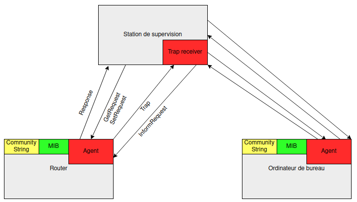
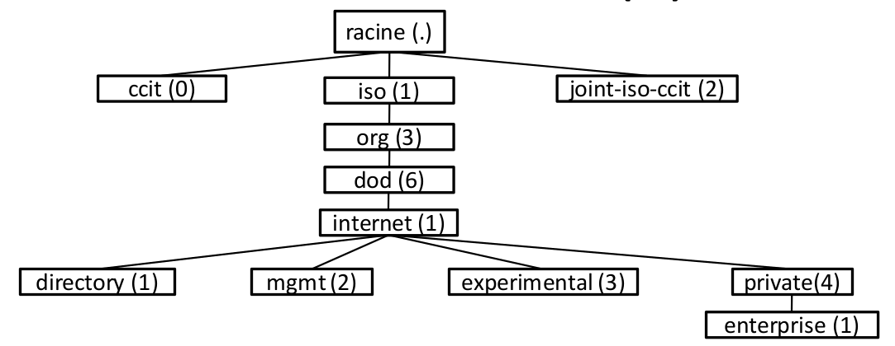

# SNMP (Simple Network Management Protocol)

SNMP est un protocole de monitoring. Il permet de gérer et voir l'état des appareils d'un réseau comme des imprimantes, routers, modems, switchs et ordinateurs de bureau. SNMP est donc très utile pour détecter les pannes, réduire le temps d'intervention et analyser l'utilisation des ressources.

SNMP est apparu en 1988 et a été développé par un groupe de collaborateur avec le soutien de OSI/IETF/NSF. C'est un protocol de couche OSI Application et passe par les port 161 et 162 ou 10161 et 10162 en sécurisé.

## Fonctionnement

SNMP organise le monitoring du réseau par l'intermédiaire d'un serveur de supervision (monitoring server) appelé sobrement le superviseur. Pour que le superviseur puisse collecter des informations sur l'état des appareils du réseau il faut faire tourner un processus en arrière plan sur les machines à superviser. Ce processus deamon est appelé un agent.

### Le superviseur et les agents ont deux façons de communiquer :

* Le Polling

C'est ce qui permet une supervision active du réseau. Le superviseur envoi régulièrement des requêtes (GET ou SET) aux agents pour récupérer des informations telles que le taux d'utilisation du CPU, taux de transfert de données sur la carte réseau, les ports actifs,.. Il permet d'avoir une vue globale de l'activité sur le réseau. Par convention il utilise le port UDP 161. Il peut également servir à configurer les appareils.

* Les Traps

C'est ce qui permet une supervision passive du réseau. Lorsqu'un évènement prédéfini ce passe, l'agent envoi des informations au superviseur. Par exemple on peut définir une règle tel que si un port ethernet d'un switch est débranché, l'agent envoi une alerte au superviseur. Les Traps passent par le port 162.

### L'agent stocke sur son hôte différentes informations :
Pour savoir quelles données sont accéssibles par le superviseur, les agents stockent des variables (appelées OID) dans une base de données (appelée MIB).

* MIB (Management Information Base) Base de donnée des info de supervision

Fichier texte qui décrit les informations disponibles via SNMP sur l'appareil supervisé.

* OID (Object Identifiers)

Suite de nombre permettant de naviguer au sein de la structure du MIB. Identifiant universel

<figure>
<h3>Schéma de l'arborescence du MIB</h3>

<figcaption>Schéma provenant du cours d'Administration des réseaux de Ioura Batugowski</figcaption></figure>

* Community String

Défini les droits d'accès au MIB de l'appareil et permet de mettre un mot de passe pour l'authentification auprès de l'appareil supervisé.

## Les différentes versions de SNMP

### Version 1
La première version est facile à utiliser et contient les éléments de bases pour la gestion du réseaux. Il est simple à configurer et ne chiffre pas les données donc utilise peu de bande passante. Il est tout de même conseillé de l'utiliser que en réseau local étant donné que les données passent en claire dans le réseau.

### Version 2
La deuxième version ajoute la prise en charge des compteurs à 64 bits et l'ajout de l'opération GETBULK qui permet de demander plusieurs informations dans le MIB de l'agent. Il est à noté que la version SNMPv2c n'est pas compatible avec SNMPv1.

### Version 3
La version SNMPv3 ajoute enfin de la sécurité au protocol grâce à plusieurs mécanismes: l'authentification, le chiffrement, l'estampillage du temps et la gestion des permissions permettant de restreindre l'accès en lecture ou écriture du MIB.

## Bibliographie

* https://www.youtube.com/watch?v=mqzb_4lz_gs, Auteur: formip, Date de création: 18 septembre 2019, consulté le 5 juillet 2022
* https://www.frameip.com/snmp/, Auteur: frameip, Date de création: avant le 23 juin 2018, consulté le 5 juillet 2022
* https://www.paessler.com/fr/it-explained/snmp, Auteur: paessler, Date de création: Inconnue, consulté le 5 juillet 2022
* Slides du cours d'Administration des réseaux(Théorie) 2021, Maxime Vanlerberghe
* Slides du cours d'Administration des réseaux(Pratique) 2021, Ioura Batugowski