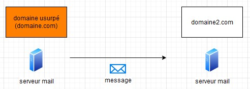

[Accueil Wiki](https://epheclln.github.io/Wiki-TI/)

---

layout: default
title: SPF
parent: Réseaux

---

# SPF

## Qu'est ce que c'est?

SPF, acronyme de Sender Policy Framework, permet d'empêcher les envois de message par des spammeurs au nom de votre domaine au moyen d'un système de validation. Spf permet a une organisation de publier des servers de messagerie autorisés. Ce framework fonctionne de pair avec DMARK. Il donne à ceux qui recoivent l'information les différentes informations par rapport à la fiabilité de l'origine du mail. [1]

Il s'agit donc d'un moyen d'autentification par nom de domaine pour éviter l'usurpation d'identité. Pour cela, il a besoin du DNS. Ainsi, tout expéditeurs peux spécifier quels serveurs peuvent envoyer des e-mails au nom de leur domaine.

## Histoire

Les premières mentions de SPF remontent au environ de 2000. La spécification de ce dernier s'est faite dans les années suivantes au moyen de plusieurs versions. Le nom original de SPF était tout d'abord "Sender Permitted Form". Ce dernier a donc évolué durant les premières versions. [1]

En 2006, une tentative de combinaison de SPF avec la proposition CallerId de Microsoft a été réalisée par un groupe de travail de l'[IETF](https://www.ietf.org/). Cette expérience aura porté ses fruits en 2014 et est maintenant connue sous le nom de RFC 7208.[1]

Actuellement, les techniques d'autentification privilègient DKIM et DMARC par rapport à SPF. Cependant, il détermine toujours si un mail est conforme au DMARC.[1]

## Dans la pratique

Pour configurer SPF, il faut au préalable ajouter un SPF record dans la zone DNA du domaine. Celui-ci permet la spécification des différentes adresses ips qui sont authorisées à envoyer des mails au nom du domaine.[1]

SPF vérifie qu'un expéditeur peux envoyé des message avec ce nom de domaine. Si pas (la vérification a échouée), le serveur récepteur détermine ce qu'il faut faire du message en fonction de la stratégie configurée.[4]

Voyons 3 cas de figures

* Dans ce premier cas, l'adresse ip se trouve dans l'enregistrement.[4] Le mail est donc valide.

* Dans ce cas présent, le domaine expéditeur a été usurpé car l'adresse ip dne se trouve pas dans l'enregitrement.[4] Le mail sera donc traité selon la stratégie configurée.

* Dans ce dernier cas, le mail a été transféré. La vérification SPF lors de la première réception est valide mais pas lors de la 2 ème car, l'adresse ip de domaine2.com ne se trouve pas dans l'enregistrement SPF de domaine1.[4]

## SPF record

le SPF record est composé de plusieurs parties. Il commence par un numéro de version, suivi par les différents mécanismes qui permettent de de définir les expéditeurs valides.[3]

* numéro de version : `v=spf1`

### mécanismes

* a : défini le record du DNS A du domaine comme source d'envoi valide.
  * `a`
  * `a:nom_du_domaine`
  * `a/prefixe`
  * `a:nom_du_domaine/prefixe`
* mx : défini le record MX du domaine comme source d'envoi valide.
  * `mx`
  * `mx:nom_du_domaine`
  * `mx/prefixe`
  * `mx:nom_du_domaine/prefixe`
* ptr : défini le nom d'hôte inverse de l'adresse ip d'envoi comme source d'envoi valide.
  * `ptr:nom_du_domaine`
* ip4 : défini l'adresse/pool d'adresse ipv4 comme source d'envoi valide.
  * `ip4:adresse_ipv4`
  * `ip4:adresse_ipv4/prefixe`
* ip6 :  défini l'adresse/pool d'adresse ipv6 comme source d'envoi valide.
  * `ip6:adresse_ipv6`
  * `ip6:adresse_ipv6/prefixe`
* inclure : inclu le SPF record our le nom de domaine.
  * `inclure:nom_du_domaine`

## Limitation

* la validation se fait uniquement sur "enveloppe de" et donc l'"en-tête de" n'est pas validée.[1]
* lors du transfert d'un mail, la personne qui transfert deviens de nouvel expéditeur et don, les vérification SPF plante.[1]
* Le maintien est plus difficiel du au manque de rapports.[1]
* SPF vérifie uniquement le nom de domaine, mais pas l'utilisateur mail(avant le`@`')[2]

## sources

* [1] Qu'est-ce que le SPF ? - DMARC Analyzer. (s. d.). DMARC Analyzer. <https://www.dmarcanalyzer.com/fr/spf-4/> consulté le 27-05-2022
* [2] <https://fr.wikipedia.org/w/index.php?title=Sender_Policy_Framework&oldid=193547601> consulté le  27-05-2022
* [3] Qu'est-ce qu'un SPF record? - DMARC Analyzer. (n.d.). DMARC Analyzer. <https://www.dmarcanalyzer.com/fr/spf-4/spf-record/> consulté le 05-06-2022
* [RFC SPF] RFC 7208
* [RFC Dmark] RFC 7489
* [4] <https://docs.microsoft.com/fr-fr/microsoft-365/security/office-365-security/how-office-365-uses-spf-to-prevent-spoofing?view=o365-worldwide> consulté le 05-06-2022
