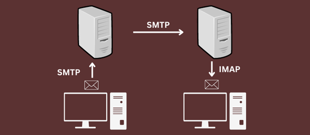

# Titre

## Qu’est-ce qu’IMAP ?

Qu’est-ce qu’IMAP ?
L'IMAP, ou Internet Message Access Protocol, est un protocole de messagerie électronique largement utilisé pour accéder et gérer les e-mails stockés sur un serveur distant. Contrairement au protocole POP3 (Post Office Protocol 3), qui télécharge généralement les e-mails sur un appareil local, l'IMAP permet aux utilisateurs de consulter leurs messages directement sur le serveur, offrant ainsi une expérience plus flexible et synchronisée sur différents appareils.

## Comment fonctionne IMAP ?

IMAP est un protocole de messagerie entrant qui agit comme un intermédiaire entre le serveur de messagerie et le client. Son fonctionnement est plutôt simple et transparent, et il se base sur une couche de transport TCP/IP pour réaliser sa tâche.

Une fois la connexion établie entre le serveur et le client, lorsque vous accédez à un e-mail, vous ne le téléchargez pas réellement, vous le lisez directement depuis le serveur. Même si vous avez l'impression de consulter vos e-mails localement, ceux-ci sont en réalité stockés sur le serveur de messagerie.

La particularité intéressante de l'IMAP réside dans le fait qu'il vous permet d'accéder à vos e-mails depuis n'importe quel appareil et de n'importe où. Que ce soit votre smartphone, votre ordinateur, votre tablette ou autre chose, cela n'a pas d'importance. Vous accédez à vos e-mails directement depuis le serveur via le protocole IMAP.

## Fonctionnement par étape :

Connexion au compte : Quand vous ouvrez votre client de messagerie, il se connecte à votre compte en utilisant IMAP. C'est comme une porte d'entrée vers vos e-mails.

Utilisation des ports : IMAP utilise les ports 143 ou 993 pour la connexion. Le port 993 avec Secure Socket Layer (SSL) est plus sécurisé et est souvent utilisé. Le port 143 est utilisé avec TCP/IP.

Affichage des en-têtes : Une fois connecté, le client vous montre les en-têtes (les informations de base) de vos nouveaux e-mails. Vous pouvez voir le sujet et l'expéditeur sans télécharger les e-mails.

Visualisation d'e-mails : Quand vous choisissez de lire un e-mail, IMAP télécharge cet e-mail spécifique. Vous pouvez voir tout son contenu, sauf les pièces jointes, qui ne sont pas téléchargées automatiquement.

Sécurité et rapidité : IMAP est sécurisé et rapide. C'est pourquoi il est préféré comme couche intermédiaire pour les clients de messagerie. Il protège vos e-mails et permet un accès rapide.

Synchronisation : Lorsque vous lisez un e-mail, IMAP le garde sur le serveur, à moins que vous ne le supprimiez. Toutes les modifications que vous apportez sont mises à jour en temps réel, et cela se reflète sur tous vos appareils.

## Avantages et inconvéniant d’IMAP : :

Avantages :

Avec IMAP, les e-mails ne sont téléchargés que lorsque vous les ouvrez, offrant un accès rapide via le client sans nécessiter de pré-téléchargement. Cet accès peut se faire depuis n'importe quel appareil, comme un PC, une tablette ou un smartphone, partout dans le monde. Les e-mails sont synchronisés en permanence avec le serveur.

IMAP stocke tous les e-mails, reçus ou envoyés, sur un serveur distant. Vous pouvez y accéder à tout moment, donnant l'impression qu'ils sont enregistrés localement. Les pièces jointes sont téléchargées pour une consultation hors ligne.

Il permet l'organisation en dossiers, sous-dossiers et signalement des e-mails importants. Lecture, tri, recherche et organisation sont simples.

L'extension IDLE d'IMAP signale les e-mails lus/non lus dans la boîte de réception.

IMAP est un protocole rapide, simple et pratique pour accéder rapidement aux e-mails via Internet. Sa popularité grandit parmi les utilisateurs et les clients de messagerie de premier plan en tirent parti.

Inconvéniants : 

Bien que l'IMAP offre des avantages en matière de gestion des e-mails, il n'est pas exempt de limitations. 

Une connexion Internet est essentielle pour lire, télécharger des pièces jointes et répondre aux e-mails via IMAP. 

L'accès hors ligne est restreint et les pannes de serveur peuvent perturber l'accès aux e-mails. De plus, l'utilisation d'espace de stockage sur le serveur peut poser problème, nécessitant la suppression d'e-mails anciens. 

Les utilisateurs actifs peuvent également nécessiter plus d'espace serveur. 

Pour finir, l'authentification en texte clair expose les données sensibles.

## Sécurité liée à IMAP :

IMAP présente des avantages attrayants et une compatibilité étendue avec divers appareils, ce qui contribue à sa croissance continue. Cependant, il est important de noter quelques problèmes de sécurité inhérents :

Tout d'abord, le stockage centralisé des e-mails sur le serveur peut poser des risques majeurs en cas de compromission. Des problèmes techniques ou des interruptions du serveur peuvent entraîner une perte d'accès aux e-mails.

De plus, en cas de compromission du serveur, des documents sensibles et des données personnelles pourraient être exposés aux pirates.

Un autre problème est que IMAP transmet les informations d'identification (nom d'utilisateur et mot de passe) en texte clair au serveur, ce qui peut être exploité par des pirates utilisant des méthodes d'analyse. Cependant, l'intégration d'IMAP avec le protocole TLS permet de crypter ces données.

Un défi majeur est l'incompatibilité de base avec l'authentification multi-facteurs (MFA). Cette absence rend les comptes vulnérables aux attaques de force brute. Les organisations craignent les risques liés à cette vulnérabilité et évitent parfois d'utiliser IMAP.

## Bibliographie

1 [À propos des clients IMAP et POP](https://support.google.com/a/answer/12103?hl=fr#:~:text=Le%20protocole%20IMAP%20vous%20permet,avez%20re%C3%A7us%20sur%20votre%20appareil.), consulté le (26-08-2023)

2 [Fonctionnement du protocole POP et IMAP](https://www.kalanda.net/apps/index.php/knowledgebase/27/Fonctionnement-du-protocole-POP-et-IMAP.html), consulté le (26-08-2023)

3 [À propos des clients IMAP et POP](https://geekflare.com/fr/imap-internet-message-access-protoco/),  consulté le (27-08-2023)

4 [POP et IMAP : différences, avantages et inconvénients](https://www.lorientlejour.com/article/650498/POP_et_IMAP%2B%253A_differences%252C__avantages_et_inconvenients.html),  consulté le (27-08-2023)

5 [IMAPS - Service IMAP sécurisé](https://cric.grenoble.cnrs.fr/Utilisateurs/IMAPS/#:~:text=Ouvrir%20la%20configuration%20des%20comptes,d%C3%A9fini%20automatiquement%20par%20le%20logiciel),  consulté le (27-08-2023)

6 [INTERNET MESSAGE ACCESS PROTOCOL - VERSION 4rev1](https://datatracker.ietf.org/doc/html/rfc3501),  consulté le (27-08-2023)

7 [Mon compte email : choisir POP ou IMAP ?](https://www.betterweb.fr/blog/mon-compte-email-choisir-pop-ou-imap),  consulté le (27-08-2023)

8 [Qu’est ce qu’un compte IMAP et comment l’utiliser?](https://www.strato.fr/faq/mail/quest-ce-quun-compte-imap-et-comment-lutiliser/),  consulté le (27-08-2023)

